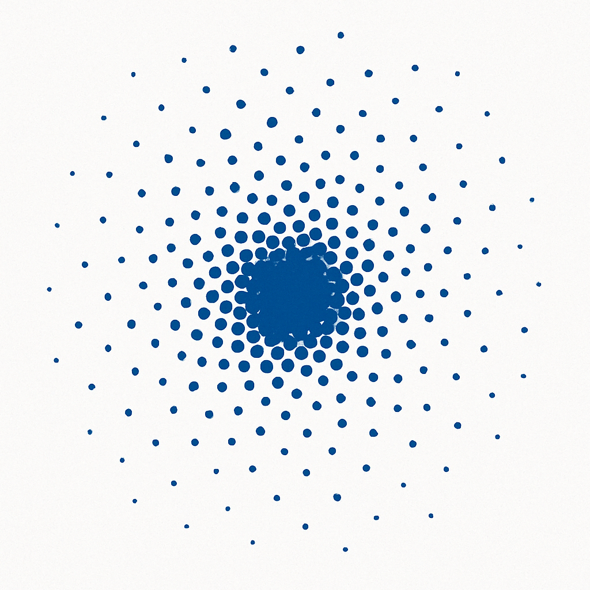
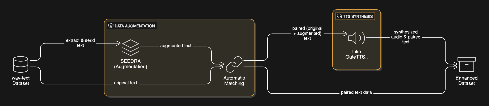

# SEEDRA



## MODEL DOWNLOAD

**MODEL** : [devJy/SEEDRA-zero-small](https://huggingface.co/devJy/SEEDRA-zero-small)  
**Feature** : 1500 steps – (A100) – loss 0.518100

## What is SEEDRA?

SEEDRA is an AI for data augmentation. It can effectively expand datasets by utilizing various sentence structures, rearrangements, synonyms, and more.

## Why use SEEDRA?

### Reducing Financial Barriers to Entry

When using GPT or DeepSeek to generate data (collecting naturally occurring data is generally very difficult for individuals or small companies), building 3,000 unique data pairs typically costs around \$20 on average (though this varies depending on the token volume of the actual dataset).

Assuming you need at least 100,000 data points to fine-tune a small model for a proof of concept, you would incur costs of approximately \$700. (As the dataset grows, duplicated entries become more frequent, so actual costs can be even higher.)

Moreover, for heterogeneous or highly specialized domains, if you assume you need at least 300,000 data points, costs will scale up accordingly.

SEEDRA runs within a single GPU with 10 GiB of memory—making it accessible even if you or your company don’t have a GPU, as it can be run in Colab.

### Securing Subtoken Coverage via Data Augmentation

By exposing the model to diverse synonyms and sentence patterns during training, you improve its ability to recognize and consistently generate rare tokens (including domain‑specific ones) at inference time.

Mid‑scale models (27 B, 70 B+) perform very well on general‑domain text but may see accuracy drop when they encounter specialized terms or expressions that were not included in their training data.

By contrast, smaller “core” models (1 B, 3 B, 8 B, 14 B) often struggle with efficient inference. In particular, 1 B and 3 B variants remain popular with enterprises due to their lower resource requirements—but their out‑of‑the‑box performance can be limited. Data augmentation (e.g., synonym expansion, alternative sentence structures) can effectively upgrade these small models’ inference capabilities.

## How to use SEEDRA


1. If you need to build a special instruction dataset or have a domain-specific training dataset, you can augment it using SEEDRA.
2. For example, Qwen 2.5 is a very powerful model, strong in Chinese and English but somewhat weak in Korean. In such cases, you can use SEEDRA to augment Korean data—using varied expressions and sentence orders to secure more subtoken coverage and strengthen its Korean capabilities.
3. In a multimodal workflow, you can convert SEEDRA‑generated text into speech using a tool like OuteTTS, then feed that synthesized audio into an ASR (automatic speech recognition) model as additional training or validation data.



## DEMO

```python
from transformers import pipeline
import torch

pipe = pipeline(
    "text-generation",
    model="devJy/SEEDRA-zero-small",
    torch_dtype=torch.bfloat16
)

sentence = "I have to go to work, but I'm so sleepy that I want to sleep more instead of going to work."

SYSTEM_PROMPT = """You are a similar sentence generation Assistant.
For the instructions below, output **only** an array of similar sentences in JSON format.
Example output: ["similar_sentence1","similar_sentence2"]"""

messages = [
        {"role": "system",    "content": SYSTEM_PROMPT},
        {"role": "user",      "content": sentence},
]

output = pipe(messages, max_new_tokens=4096)

print(output[0]["generated_text"][-1]["content"])


# terminal output
# ["I need to go to work, but I'm feeling so tired that I'd rather sleep than go to work.",
#  "I have to go to work, but I'm so drowsy that I'd rather sleep than go to work.",
#  "I have to go to work, but I'm so fatigued that I'd rather sleep than go to work.",
#  "I need to go to work, but I'm so exhausted that I'd rather sleep than go to work.",
#  "I have to go to work, but I'm so sleepy that I'd rather sleep than go to work."]

```

## SFT LOSS Comparison Using SEEDRA

_(To be updated later.)_
