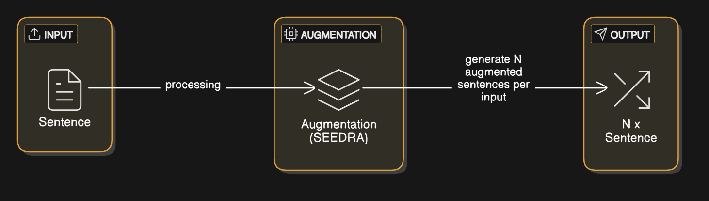

# SEEDRA


## MODEL DOWNLOAD

**MODEL** : [devJy/SEEDRA-zero-small](https://huggingface.co/devJy/SEEDRA-zero-small)
**Feature** : 1500steps - (A100) - loss 0.518100

## What is SEEDRA?

SEEDRA is an AI for data augmentation. It can effectively expand datasets by utilizing various sentence structures, rearrangements, synonyms, and more.

## Why use SEEDRA?

### Reducing Financial Barriers to Entry

When using GPT or DeepSeek to generate data (collecting naturally occurring data is generally very difficult for individuals or small companies), building 3,000 unique data pairs typically costs around $20 on average (though this varies depending on the token volume of the actual dataset).

Assuming you need at least 100,000 data points to fine-tune a small model for a proof of concept, you would incur costs of approximately $700. (As the dataset grows, duplicated entries become more frequent, so actual costs can be even higher.)

Moreover, for heterogeneous or highly specialized domains, if you assume you need at least 300,000 data points, costs will scale up accordingly.

SEEDRA runs within a single GPU with 10 GiB of memory—making it accessible even if you or your company don’t have a GPU, as it can be run in Colab.

### Securing Subtoken Coverage via Data Augmentation

Mid‑range models (27 B, 70 B+) can generally handle inference in common domains without extensive synonym coverage. Still, introducing diverse subtokens and varied batch examples further boosts inference efficiency—and yields even greater gains in highly specialized or niche domains.

By contrast, smaller “core” models (1 B, 3 B, 8 B, 14 B) often struggle with efficient inference. In particular, 1 B and 3 B variants remain popular with enterprises due to their lower resource requirements—but their out‑of‑the‑box performance can be limited. Data augmentation (e.g., synonym expansion, alternative sentence structures) can effectively upgrade these small models’ inference capabilities.

## How to use SEEDRA



1. If you need to build a special instruction dataset or have a domain-specific training dataset, you can augment it using SEEDRA.

2. For example, Qwen 2.5 is a very powerful model, strong in Chinese and English but somewhat weak in Korean. In such cases, you can use SEEDRA to augment Korean data—using varied expressions and sentence orders to secure more subtoken coverage and strengthen its Korean capabilities.

 3. In multimodal scenarios, you can also augment speech-recognition datasets using tools like OuteTTS through SEEDRA.

## DEMO

```py

```

## SFT LOSS Comparison Using SEEDRA

_(To be updated later.)_
